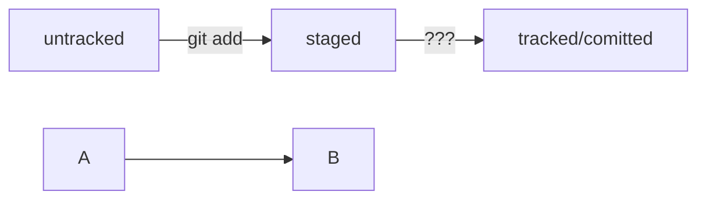

# Шпаргалка markdown

ТУТ [Шпаргалка markdown это cсылка на Git по разметке](https://gist.github.com/fomvasss/8dd8cd7f88c67a4e3727f9d39224a84c "Ссылка на Git по разметке")
[Яндекс] (https://www.yandex.ru "Я Yandex!")
## Выделение текста

Вы можете выделять текст в markdown с помощью символов `_` или `*`. Например:

Пример _курсива_ и **жирного** текста.

## Заголовки

Заголовки можно создавать с помощью символа `#`. Чем больше `#`, тем меньше заголовок. Например:

# Заголовок первого уровня
## Заголовок второго уровня
### Заголовок третьего уровня

## Выделение кода

Чтобы выделить текст как код, поместите его в тройные кавычки ```. 

```
mkdir my_project
cd my_project
git init
```

Это лишь некоторые функции markdown.

# Проверка поля Dart

```dart
Class User {
  String? name;

  User({required this.name});
}
```

---

# Git

git
символ ~ — обозначение домашней директории.

pwd = (от англ. print working directory — «показать рабочую папку»). Она выводит путь к текущей деректории.

cd = (от англ. change directory — «сменить директорию») С помощью терминала вы всегда можете перейти

ls = (от англ. list directory contents — «отобразить содержимое директории»).Вывести содержимое директории


touch = (англ. «коснуться») создание файла

mkdir = (от англ. make directory — «создать директорию») создание директории

cp = (от англ. copy — «копировать») копирование файлов (что копируем что копируем куда копируем)

mv = (от англ. move — «переместить»)


cat = (от англ. concatenate and print — «объединить и распечатать»)

Удаление файлов и папок — rm, rmdir, rm -r = (от англ. remove — «удалить») 


---git---


git init = Инициализировать репозиторий

rm -rf .git - удалить 

git status = проверить состояние репозитория

git add "файл" или ("-all" все, "." текущую папку со всеми файлами) = подготовить файл к сохранению

git commit ("-m" присвоить коммиту сообщение)= сохранить коммит

git log = выводит список коммитов.


// ssh-keygen -t ed25519 -C "электронная почта, к которой привязан ваш аккаунт на GitHub" 

// ls -a ~/.ssh		ls -la ~/.ssh 


git remote add = Привязать удалённый репозиторий к локальному (Эта команда принимает имя удалённого репозитория (или псевдоним origin) и его адрес.)


git push == Отправить изменения на удалённый репозиторий 

git push -u origin main == В первый раз эту команду нужно вызвать с флагом -u и параметрами origin (имя удалённого репозитория) и main или master (название текущей ветки).

# Блок схема в md



Большинство файлов в проектах «шагает» по следующему циклу: «изменён» → «добавлен в список на коммит» → «закоммичен» → «изменён» → и так далее.

```mermaid
graph LR;
  изменён -- "git add" --> добавлен в список на коммит;
  добавлен в список на коммит -- "git commit" --> закоммичен;
  закоммичен -- "изменён" --> и так далее;

%% стрелка без текста для примера: 
  A --> B;
``` 
